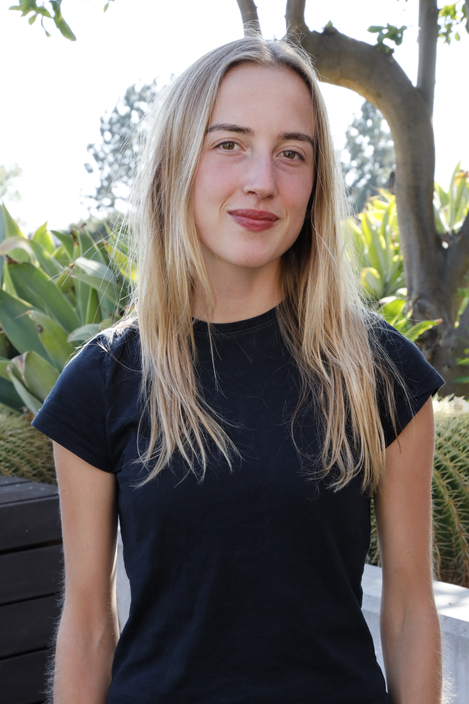
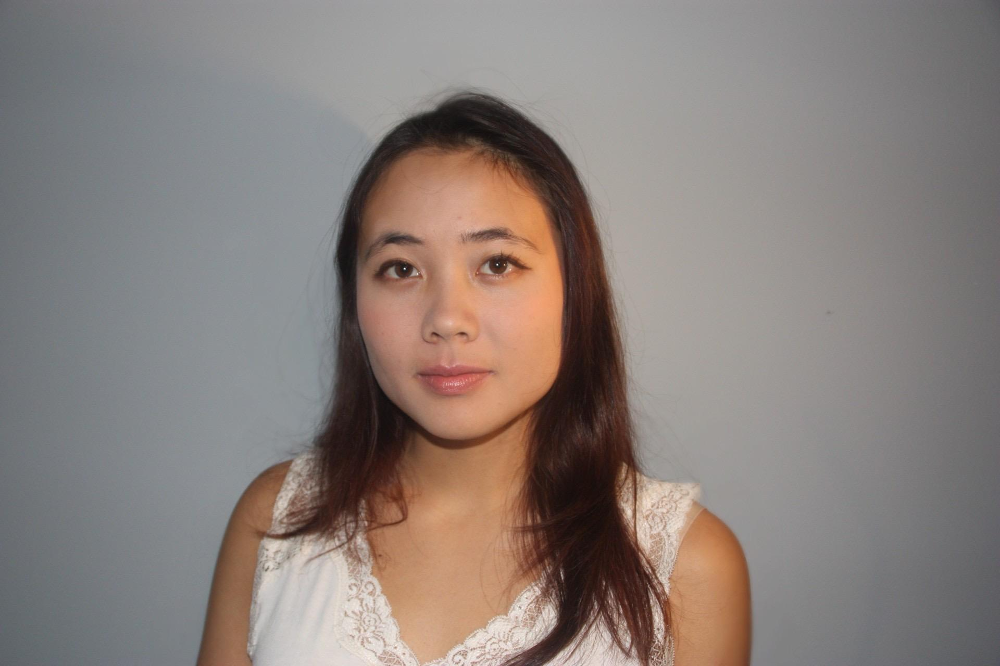

# Meet the Team

```{=html}
<style>
.team-container {
  display: flex;
  flex-wrap: wrap;
  justify-content: space-around;
  gap: 20px;
}

.team-member {
  display: flex;
  flex-direction: column;
  align-items: center;
  text-align: center;
  max-width: 300px;
}

.headshot img {
  border-radius: 50%;
  width: 200px;       /* Controls the size */
  height: auto;       /* Keeps proportions correct */
  aspect-ratio: 1/1;  /* Ensures the image displays as a circle */
  object-fit: cover;  /* Crops the image nicely without distortion */
  object-position: center 5%;
  margin-bottom: 15px;
  box-shadow: 0 4px 8px rgba(0, 0, 0, 0.2);
}

.bio h3 {
  margin: 10px 0;
}

.social-links a {
  margin: 5px;
  text-decoration: none;
  color: #007acc;
  font-weight: bold;
}

.social-links a:hover {
  text-decoration: underline;
}
</style>
<div class="team-container">


  <div class="team-member">
    <div class="headshot">
      
    </div>
    <div class="bio">
      <h3>Bella Hottenrott</h3>
      <div class="social-links">
        <a href="https://www.linkedin.com/in/isabella-hottenrott-ba6200259/">LinkedIn</a>
        <a href="https://github.com/Isabella-Hottenrott/">GitHub</a>
        <a href="https://isabella-hottenrott.github.io/hmc-e155-portfolio/">E155 Website</a>
      </div>
      <p>Bella is a senior engineering student, focusing in electrical and computer engineering. She enjoys the intersection between hardware and digital design and has loved her time enrolled in MicroPs.</p>
    </div>
  </div>


  <div class="team-member">
    <div class="headshot">
      
    </div>
    <div class="bio">
      <h3>Wava Chan</h3>
      <div class="social-links">
        <a href="https://www.linkedin.com/in/wava-chan-b2b894215/">LinkedIn</a>
        <a href="https://github.com/wchan03">GitHub</a>
        <a href="https://wchan03.github.io/e155Website/">E155 Website</a>
      </div>
      <p>Wava Chan just graduated from Harvey Mudd College with a degree in engineering. She is interested in firmware and hardware development, and embedded systems. She really enjoyed this project, even through the late nights, and was very excited when the LCD screen worked!</p>
    </div>
  </div>


</div>
```