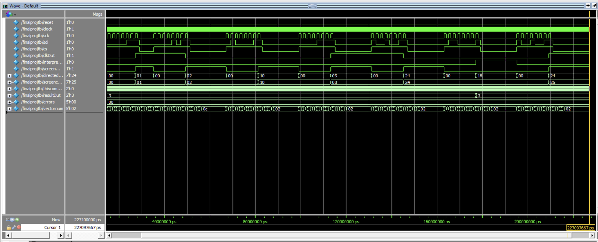
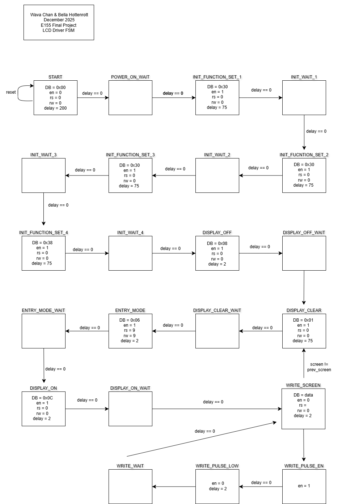
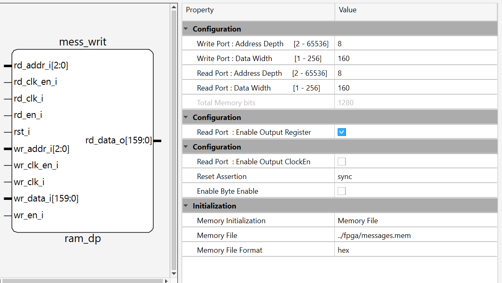
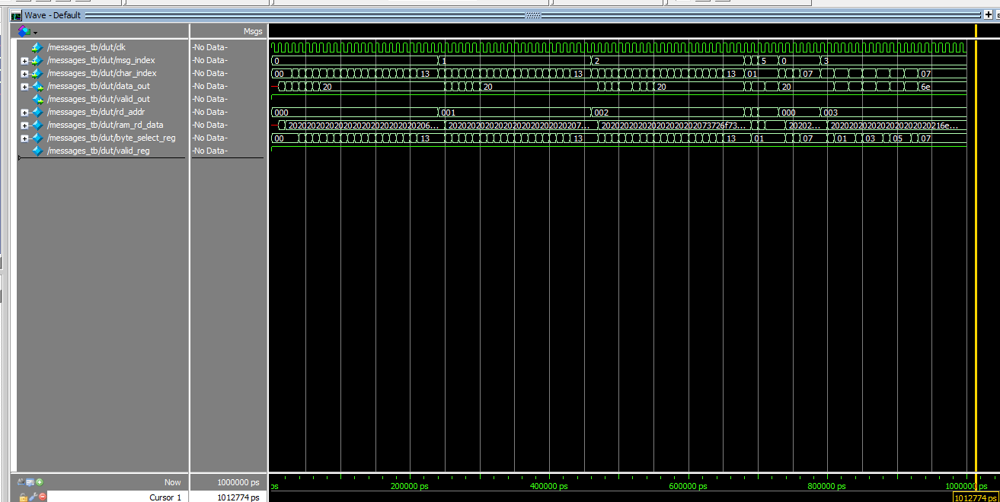
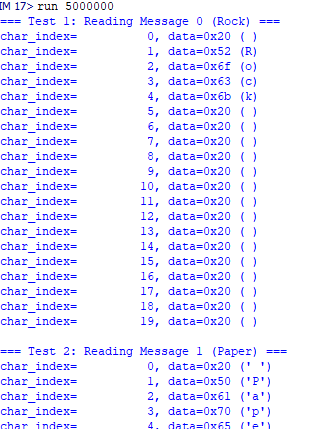

# FPGA Components

In this project, the iCE40UP5K FPGA board from Lattice was used. The two major processes involved on the FPGA involved interpretation of data from the MCU, executing game logic, and driving the LCD screen.

## Reading SPI & Data Interpretation

### SPI Reception

To interface the MCU with the FPGA, a SPI-receiver module was built that reconstructs each 8-bit transaction from the serial data in. On the ninth clock cycle of the transaction, the module outputs a packaged 8-bit signal in parrallel. A syncrhonizer then transfers this data into the clock domain of the FPGA.

### Data Interpretation

Incoming data fell into two groups:

- Display commands to update the LCD screen
- Game-state processing

This classification was encoded into the byte sent from the MCU, allowing a multiplexer module to distinguish between the two and direct internal data flow to its corresponding modules. Signals commanding an update on the display was sent to a decoder that pulled the correct message from memory. Signals for game processing were sent to modules that interpreted the game state and precalculated the next computer move using game logic.

## Game Logic

The game logic for this project was integrated as a collection of _optional_ modules within the FPGA design. Our decision model was derived from strategies published in a [study](https://arxiv.org/pdf/1404.5199v1) on competition phenomena. The computer's next move depends on two factors: the outcome ofthe previous round {win, lose, tie}, and the user's previous gesture {rock, paper, scissors}. These values were encoded as internal state, providing context for the FPGA across rounds. 

When a new user gesture arrives from the LiDAR sensors, the logic immediately determines the outcome of the current round by comparing it with a precomputed computer move. At the same time, it precalculates the next computer move using the game theory. This calculation assumes perfect hidden information, so the next-move computation does not depend on any current-round data. 

The full game-logic pipeline was validated using a testbench below and passed all evaluated cases.

## LCD

A 20x2 LCD was implemented, allowing the ability to display messages up to 40 characters in length. The system needed to display 11 various messages, the data of which was retrieved using the messages.sv submodule.

To interface with the display, the lcd_driver module was responsible for controlling the LCD's eleven input pins. This dirver used an FSM to step through all the various initialization steps, write the desired message to the LCD screen, and retrieve the necessary data from the internal EBR on the FPGA.

To keep track of screen updates, the system _TRACKED_ the current and previous screen. When these differed, the driver repositioned the cursor and cleared the display before writing a new message. Otherwise, the FPGA continuously cycled through the same 20-character message, appearing static to the user.

Several states in the FSM required a precise wait period to allow for proper initialization. A counter was implemented to determine these specific time periods. The maximum counter value was set before the _WAIT_ states, only exiting these states when the counter reached 0.

### Hardware

The LCD interface required eleven FPAG pins: eight for a parrallel data bus (DB [7:0]) and three control signals- enable (en), read/write (rw, for internal ROM), and data select (rs). The backlight for the LCD was powered by 5V, and the character contrast was determined using a variable voltaged provided by a potentiometer.

Once the initialization and command sequences were completed, the LCD displayed characters corresponding to the ASCII code communicated over the DB pins. 

### Memory

Eleven different messages needed to be displayed on the LCD. Each message consisted of 20 ASCII characters, each of which represented by two hex digits, totalling to 40 bytes. While these couldhave been hard-coded directly into the RTL, using the FPGA's embedded block RAM produced a cleaner design and provided experience working with on-chip memory.

To configure the memory, the Lattic IP generator was used to specify the exact ROM size (160 x 22). Retrieval of each word from the EBR was accomplished by inputting the address of the message.
To store all these messages in memory, a .mem file was produced with a python sscript and accessible to the FPGA.

The waveforms show validation of the memory integration.

Each line corresponds to a message address, where the first message is at address 0, the second message is at address 1, and so on. Messages contained the ASCII character values and were further padded with 0x20- the code for extra space to produce 160 bit data messages.
	
The top-level memory module took in a message address and a character index, indicating which character should eb written in that moment.
