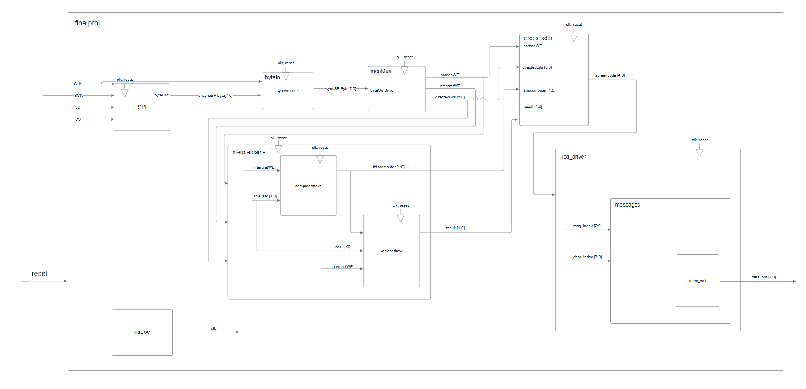
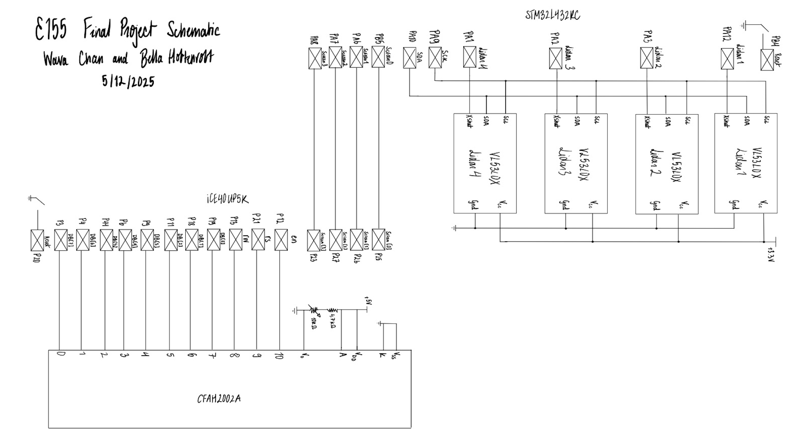

# Abstract

This project implements a rock-paper-scissors game in hardware, enabling a user to play directly against the computer. The system captrues user's hand gestures using LiDAR sensors that classify the hand shapes. An LCD screen communicates prompts, system feedback, and game results with the user. 

When the game begins, the user is asked to press a button to indicate the start of a new round. The user is then prompted to present a gesture. The LiDAR system interprets this and forwards the result to the FPGA, which displays outcomes and game state on the LCD. The display then resets to the initial prompt, preparing for the next round. A user can proceed to a new round, playing against a game logic implementation and likely increasing the difficulty of winning.

# Overall Design

### Software

The system is built around two main controllers- the STM32L432KC micrcontroller and the iCE40UP5k FGPA ont he UPduino development board.

The MCU interfaced with an array of VL53L0X time-of-flight sensors to capture the user's hand gesture. The  gestures were classified, and the result was transmitted to the FPGA via SPI. An appropriate output emssage for the LCD was then sent over by the FPGA. 

This design implemented additional game logic on the FPGA that and then used that data to determine the hand gesture of the user. Then, it would send a message over SPI to the FPGA, which would compare the user’s play to the computer’s play, and output the appropriate message(s). The FPGA was also used to implement some game logic, where the computer’s next move was determined based on the user’s previous move, to make it more difficult to beat, and more interesting than just randomized plays. 

The block diagram for the software portion is pictured below.

{fig-align="center"}

### Hardware

The hardware implementation was simple for this design, providing the neccessary connection between the major components of the system. 

{fig-align="center"}
