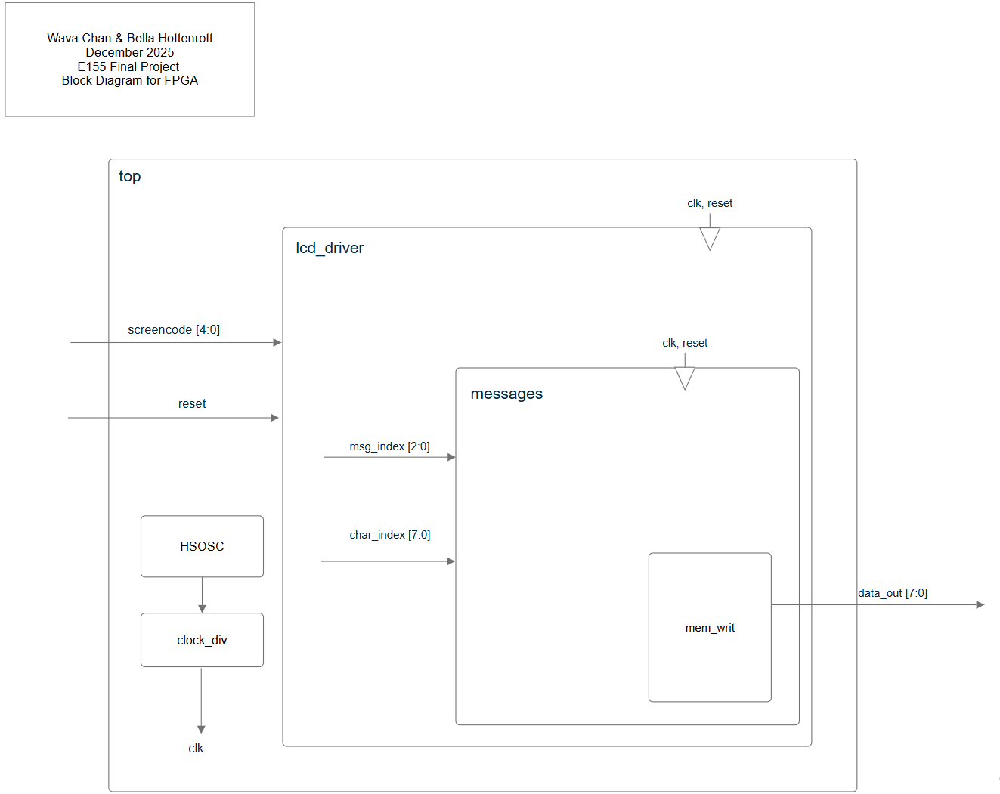

# Results
We were able to successfully play rock paper scissors against the computer. The LiDAR senses the move from the player, and then 

There are a couple of key differences from our original design: 
Game logic is implemented on the MCU instead of the FPGA 
The FPGA and MCU no longer communicate over SPI, instead it is simply parallel communication
Removal of the 10-round system– you can just play forever, instead!

# Demo
[Images + video here]

# Issues

Our changes were made to ensure we could produce a working game before the end of our allotted time. Though we have faith in our original design, we made changes to fit better with our timeline and circumvent a variety of issues we encountered. 

The FPGA game logic worked in simulation, but we ran into integration issues. We suspect that it was something with the differing clocks between the MCU and the FPGA, and that the SPI messages weren’t being received right, but ran out of time to fully debug and fix these issues. Instead, we moved the game logic to the MCU, where we knew it would work. This also meant we changed the way the FPGA and MCU communicated. Though at one point we had SPI fully functional (at the mid-point checkoff), we wanted to reduce the number of areas to debug for our final work. Thus, we switched to serial communication, especially since the messages we needed to communicate were very simple (only 3 bits). 

The 10 round system was good in theory, but in reality, no one wants to play 10 rounds of rock paper scissors. It is easier for demonstration purposes just to be able to play as many times as the user wants, whether that be 1 or 10 times. 

The LiDAR sensors kept throwing an error we couldn’t figure out or reconfigure, even after resetting them. So, we weren’t able to use all the sensors we had purchased. However, we had considered this eventuality and had bought extras at the beginning of the project. It still would have been nice to have extra sensors to experiment with, and refine and develop the gesture recognition further. 
